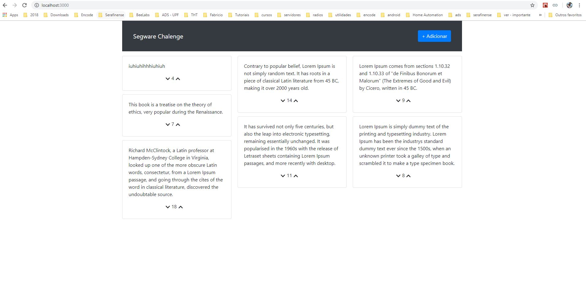

# Segware Chalenge
Projeto simples desenvolvido pra testar o domínio de algumas tecnologias.

## Passos pra execução do projeto
* instalar o Docker https://www.docker.com/
* Acessar a pasta raiz do projeto pelo terminal
* Executar o seguinte comando:
`docker-compose up --build`

## Client
`localhost:3000`

## Server
`localhost:8080`

## Database
```
localhost:80
db: segwaredb
user: root
pw: 123456
```

## Tela Inicial
